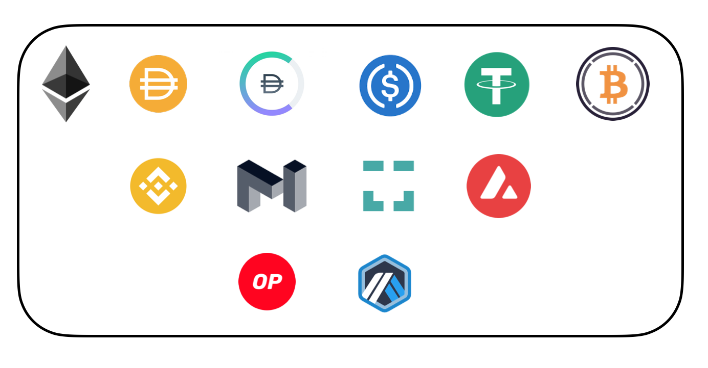

# Introduction to Tornado Cash

Tornado Cash is a **fully decentralized** **non-custodial** **protocol** allowing private transactions in the crypto-space.

As a decentralized protocol, Tornado.Cash smart contracts have been implemented within the Ethereum blockchain, making them immutable. They can neither be changed nor tampered with. Therefore, nobody - including the original developers - can modify or shut them down. All governance and mining smart contracts are deployed by the community in a decentralized manner.

As a non-custodial protocol, users keep custody of their cryptocurrencies while operating Tornado.Cash. This means that at each deposit, they are provided with the private key enabling the access to the deposited funds, which gives users complete control over their assets.

## How is privacy achieved?

Tornado Cash improves transaction privacy by breaking the on-chain link between source and destination addresses. It uses a smart contract that accepts ETH & other tokens deposits from one address and enables their withdrawal from a different address.

To maximize privacy, several steps are recommended, such as the use of a relayer for gas payments to withdraw funds from an address with no pre-existing balance.

More details are available in _Behind the scenes:_ [_How does Tornado.Cash work?_](general/how-does-tornado.cash-work.md) & [Tips to remain anonymous](general/tips-to-remain-anonymous.md).

## Where does Tornado.cash operate?

Since its inception in 2019, Tornado Cash has been operating **on the Ethereum blockchain**. The protocol has been offering diversified fixed amount pools for six tokens (ETH, DAI, cDAI, USDC, USDT & WBTC) handled by the Ethereum blockchain.

Since June 2021, in addition to the Ethereum blockchain, Tornado Cash smart contracts **have also been deployed on other side-chains & blockchains**. These deployments enabled the tool to either support new tokens or benefit from Layer-2 advantages, such as faster and cheaper transactions.

As of today, Tornado Cash is operating on:

* **Ethereum Blockchain** : **ETH** (Ethereum), **DAI** (Dai), **cDAI** (Compound Dai), **USDC** (USD Coin), **USDT** (Tether) & **WBTC** (Wrapped Bitcoin),
* **Binance Smart Chain**: **BNB** (Binance Coin),
* **Polygon Network**: **MATIC** (Polygon),
* **Gnosis Chain (former xDAI Chain)**: **xDAI** (xDai),
* **Avalanche Mainnet**: **AVAX** (Avalanche),
* **Optimism**, as a Layer-2 for **ETH** (Ethereum),
* **Arbitrum One**, as a Layer-2 **ETH** (Ethereum).

Until December 2021, the protocol included an anonymity mining system for some of these tokens, allowing its users to earn a governance token (**TORN**). Users were able to ultimately earn TORN on the Blockchain network by depositing in the ETH, DAI, cDAI & WBTC pools.

_More information on_ [_Anonymity mining_](tornado-cash-classic/anonymity-mining.md) _&_ [_Tornado.Cash token_](general/torn.md) is _available._

**Thanks to the TORN token, Tornado Cash users can actively participate in shaping the protocol**. The community has a strong weight regarding the evolution of Tornado Cash and the improvement of its features. Indeed, protocol parameters & token distribution are completely under the community’s control through this governance.

All pools mentioned above can be accessed on [tornadocash.eth.link](https://tornadocash.eth.link). They operate **under the principle of fixed-amount deposits & withdrawals**. It means that each token has 2 to 4 different pools, allowing transactions of only 2 to 4 different fixed amounts _(e.g. ETH has four different pools, one for each of these amounts: 0.1, 1, 10 & 100 ETH)_.

### Tornado Cash Nova

With the [**release of Tornado Cash Nova** (beta version) on December 2021](https://tornado-cash.medium.com/tornado-cash-introduces-arbitrary-amounts-shielded-transfers-8df92d93c37c), an **upgraded pool with unique new features** has been added to the protocol. Users are no longer constrained by fixed-amount transactions. With the addition of Tornado Cash Nova, they can benefit from the use of **an arbitrary amount pool & shielded transfers**.

Tornado Cash Nova operates on the Gnosis Chain (former xDai Chain) as a Layer2 to optimize speed and cost. It allows **deposits and withdrawals of completely customized amounts in ETH**. This pool also enables shielded transactions where users can **transfer the custody of their token while remaining in the pool**.

Tornado Cash Nova (beta version) can be accessed on [nova.tornadocash.eth.link](https://nova.tornadocash.eth.link). You can find further informations related to the functioning of Tornado Cash Nova in the dedicated section of our docs.

## How does Tornado.Cash run?

[Codes behind Tornado.Cash functioning](https://github.com/tornadocash) - smart contacts, circuits & toolchain - are fully **open-sourced.** Working as a DAO (Decentralized Autonomous Organization), Tornado.Cash governance and mining smart contracts are deployed by its community.

The protocol also functions with zk-SNARK, which enables zero-knowledge proofs allowing users to demonstrate possession of information without needing to reveal it. The use of this technology is based **on open-source research made by Zcash team with the help of the Ethereum community**. To set up zk-SNARK initial keys, Tornado.Cash[ Trusted Setup Community](https://tornado-cash.medium.com/tornado-cash-trusted-setup-ceremony-b846e1e00be1) was launched in May 2020 & accounts [for 1114 contributions](https://tornado-cash.medium.com/the-biggest-trusted-setup-ceremony-in-the-world-3c6ab9c8fffa). This significant number of contributors makes it impossible to compromise the protocol by faking zero-knowledge proofs.

User interface is hosted on **IPFS** (InterPlanetary File System) by the community, minimizing risks of data deletion. Indeed, the interface will work as long as at least one user is hosting it.

_Written & updated by_ [_@ayefda_](https://torn.community/u/ayefda)
