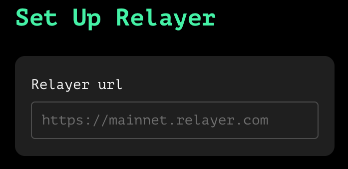
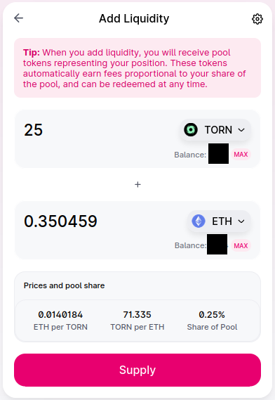
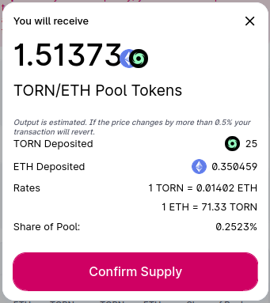
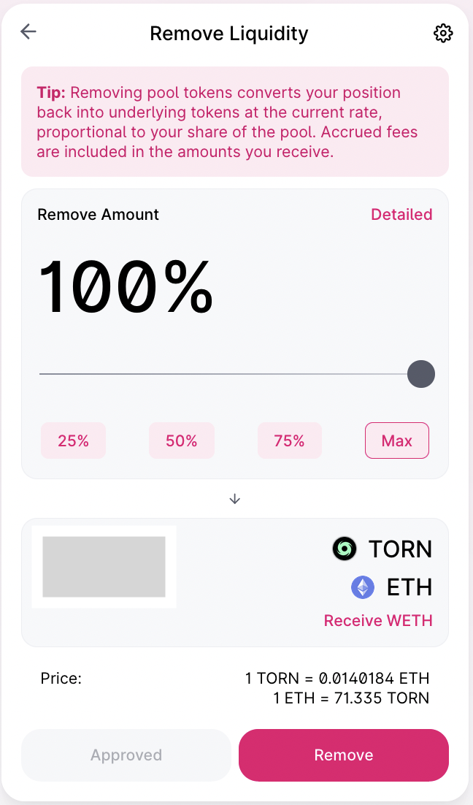
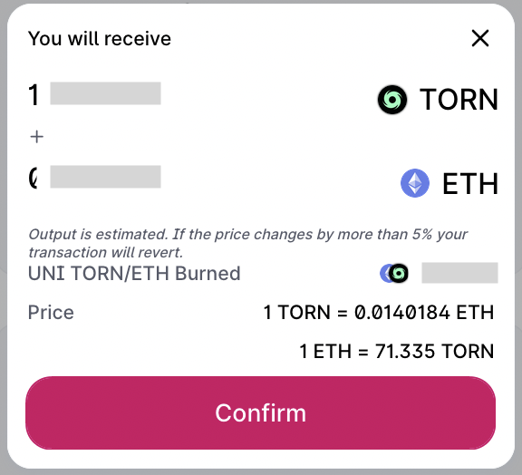

# How to add or remove liquidity on Uniswap v2

In this tutorial we will see how to add and remove liquidity on Uniswap v2 TORN/ETH pair.

1. [Add liquidity](how-to-add-or-remove-liquidity-on-uniswapv2.md#add-liquidity)
2. [Remove liquidity](how-to-add-or-remove-liquidity-on-uniswapv2.md#remove-liquidity)

### 1. Add liquidity

1. Go there: [https://app.uniswap.org/#/add/v2/ETH?chain=mainnet](https://app.uniswap.org/#/add/v2/ETH?chain=mainnet)
2. Add the TORN and ETH pair

.png>)

3\. Click on Manage

4\. Click on Add

.png>)

5\. Choose an amount to add and click on Supply

6\. Click on confirm

### 2. Remove liquidity

1. Go there: [https://app.uniswap.org/#/add/v2/ETH?chain=mainnet](https://app.uniswap.org/#/add/v2/ETH?chain=mainnet)
2. Add the TORN and ETH pair

.png>)

3\. Click on Manage

.png>)

4\. Click on Remove

.png>)

5\. Choose the percentage you wish to withdraw

### 

5\. Click on confirm

And that's it! :tada:

_Written by_ [_**@bt11ba**_](https://torn.community/u/bt11ba/)

