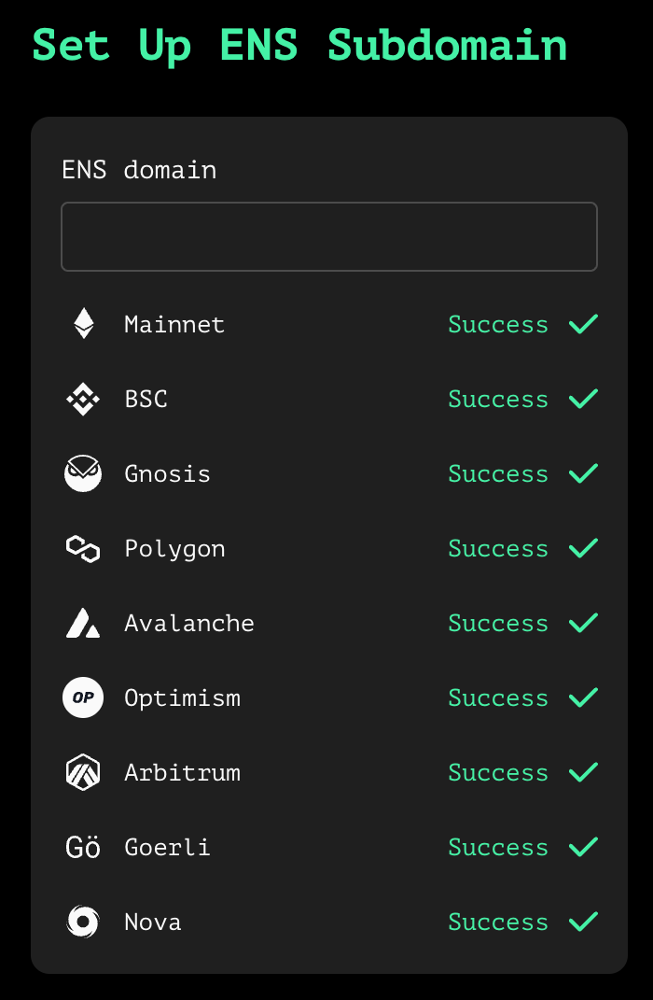
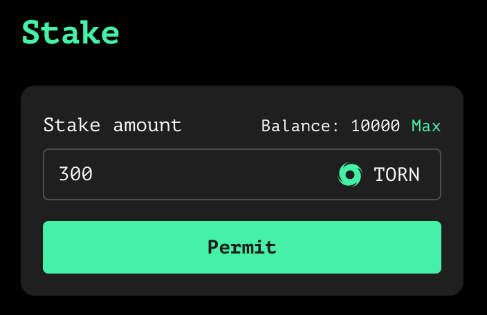
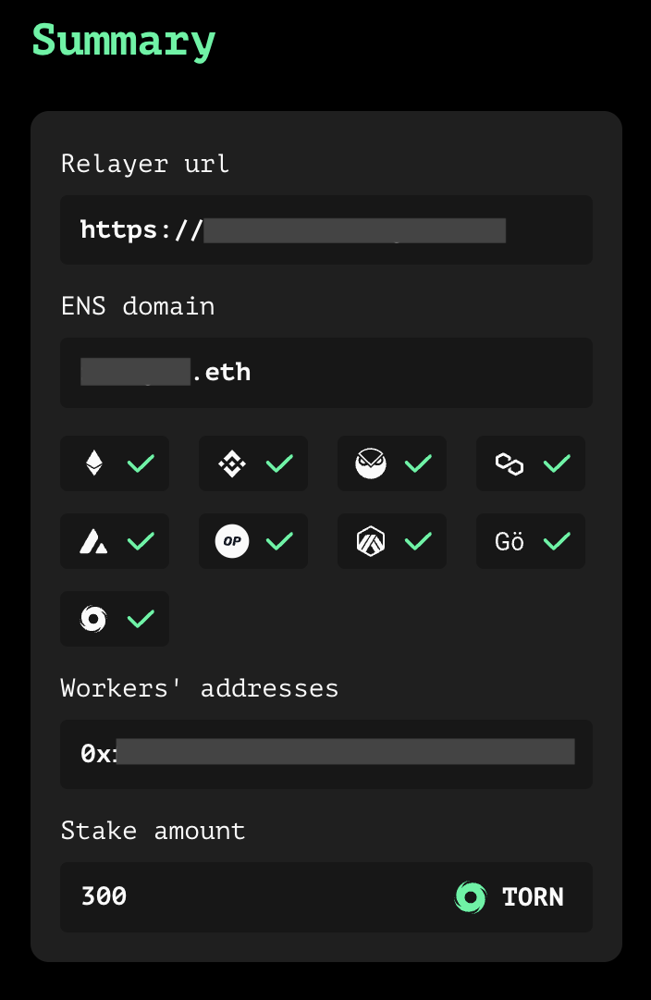

# How to Become a Relayer?

Following the execution of [Tornado Cash 10th governance proposal](https://tornadocash.eth.link/governance/10), anyone can become a relayer for Tornado Cash users.


The only condition to be included on the Tornado Cash UI is to hold a min. of `300 TORN`. This minimum stake can be changed by a governance vote at all time.


Relayers form an essential & necessary part of the Tornado Cash ecosystem. Their use guarantees privacy as they solve the infamous “fee payment dilemma” : how to pay fees for token withdrawals from a pool while maintaining anonymity?

Therefore, relayers act as a third parties and take care of the whole withdrawal. They pay for transaction fees by deducing them directly from the transferred amount. They also take an additional fee for their services.

Since [Relayer Registry proposal](https://tornadocash.eth.link/governance/10), the protocol will collect a fee directly from the relayer’s staked balance through the `StakingReward` contract for each withdrawal. This fee percentage may vary from one pool to the other and is also subject to change through on-chain governance.

It’s fixed at **** `0.3%` for now. Some pools remain without fees, either because the instance is too small to assign a fee (0.1 ETH, 100 DAI/USDT, 1000 DAI/USDT), or because there is not enough liquidity on Uni v3 (all cDAI instances).

## How to Become a Relayer ?

Anyone can become a relayer for the protocol in **6 simple steps** through a Relayer Registry User Interface (UI).

You will find below everything your need to join our relayers' club & be listed on Tornado Cash decentralized relayer registry.

### 1. Requirements: Be Aware & Accept Potential Risks

Before you commit to sharing part of your journey with Tornado Cash users as a relayer, you need to be aware & accept all potential risks of being a relayer for the protocol.

### 2. Set up Relayer

The first concrete step is to run Tornado Cash Relayer software for Ethereum Mainnet on your computer. All steps are explained in the protocol's github. To complete this task successfully, you will have to carefully follow [these instructions](https://github.com/tornadocash/tornado-relayer#deploy-with-docker-compose).



Once you are done, you will need to insert your url in the input box.

### 3. Set Up ENS Subdomain

The next step consists in:

* Creating an ENS domain for your relayer,
* Setting up its mainnet subdomain,
* Adding a TXT record with the Relayer URL to the mainnet subdomain according to this specific format:

#### **Ethereum Relayers (Mandatory)**

| TXT record              |
| ----------------------- |
| mainnet-tornado.xxx.eth |
| goerli-tornado.xxx.eth  |

#### **Sidechains Relayers (Optional)**

You also have the possibility to add subdomains with their corresponding TXT records to support other chains than Ethereum. Sidechains relayers use a different version of the Relayer software. You have all required instructions to do so [here](https://github.com/tornadocash/tornado-relayer/blob/light/README.md).

| TXT record                |
| ------------------------- |
| bsc-tornado.xxx.eth       |
| gnosis-tornado.xxx.eth    |
| polygon-tornado.xxx.eth   |
| optimism-tornado.xxx.eth  |
| arbitrum-tornado.xxx.eth  |
| avalanche-tornado.xxx.eth |

#### **Nova Relayer (Optional)**

Tornado Cash Nova uses its own version of the software. If you wish to become a relayer for Tornado Cash Nova, you will find instructions to follow [here](https://github.com/tornadocash/tornado-pool-relayer#deploy-with-docker-compose).

| TXT record          |
| ------------------- |
| gnosis-nova.xxx.eth |

### **4. Set Up Workers**

Workers are the addresses that will allow your relayer to send ZK-proofs to users. By default, the first worker is the ENS domain owner's address.

To ensure an extra level of security, we advise you to set up more than one worker.

Only the mainnet requires you to register workers. All other networks do not require the usage of registered workers.

.png>)

### 5. Stake

With the implementation of a decentralized relayer registry, a staking condition has been introduced to become listed on Tornado Cash UI. Indeed, **staking TORN is now necessary to be added to the recommended list of relayers.**

The minimum stacked amount is currently set by Tornado Cash governance at **`300 TORN`**. This threshold can be changed by Tornado Cash governance at all time.

When a relayer is used on a Tornado Cash pool, a small amount of TORN is automatically collected from this staked balance by the `StakingReward` contract. This element is essential to keep in mind as relayers will need to maintain their stakes balance above `300 TORN` at all time.

These collected fees are, afterwards, distributed among DAO members that have their TORN tokens locked. TORN are usually locked to participate in on-chain governance (suggesting & voting for proposals). You can find more information both on this [forum post](https://torn.community/t/proposal-relayer-registry-setting-parameters-after-audit/2134) & in the [Staking TORN documentation page](staking.md).


Your staked TORN amount is not claimable, and it is non-refundable.


### 6. Summary: Last Verification & Registration

The last, but not the least, we advise you to **double-check all information** present on the Summary before registering.

_Welcome to the relayer team! Thanks to you, privacy can be better respected_ 💚

_Written by_ [_**@bt11ba**_](https://torn.community/u/bt11ba/) _**** &_ [_**@ayefda**_](https://torn.community/u/ayefda)****
