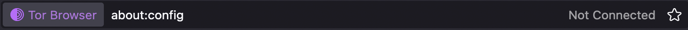
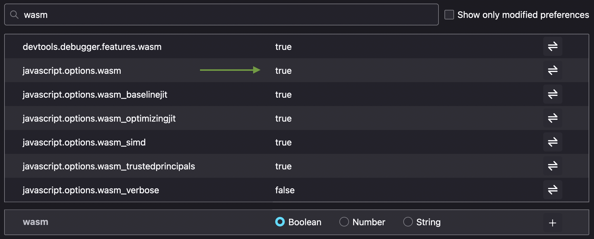
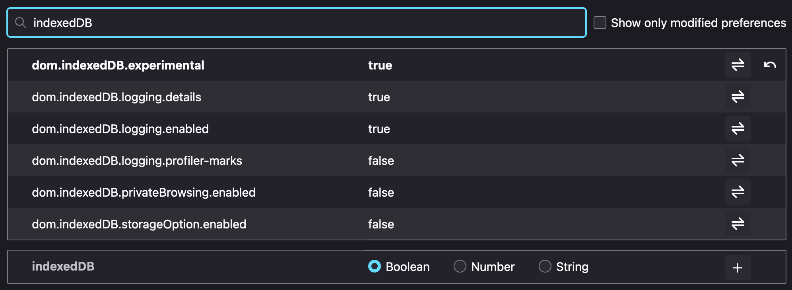
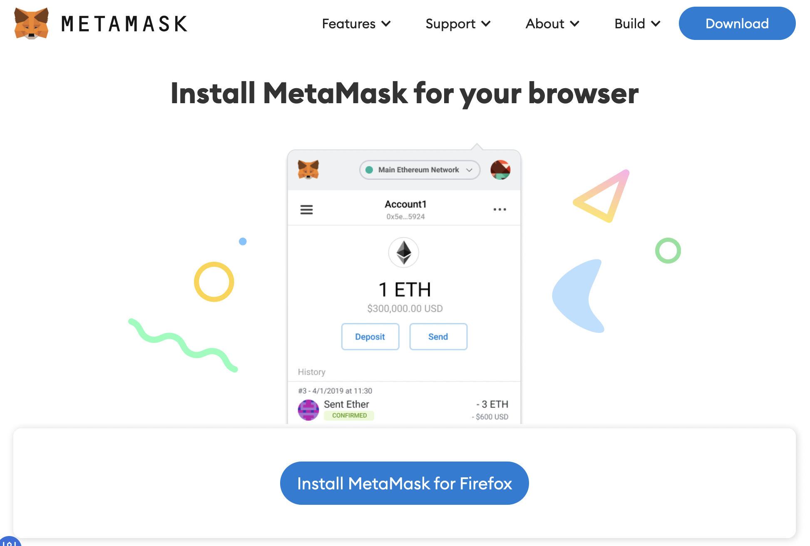
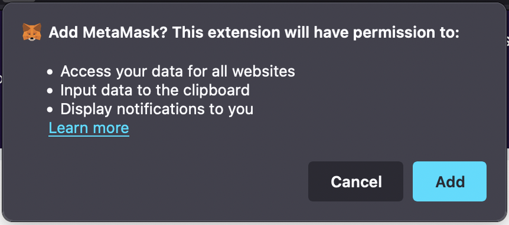
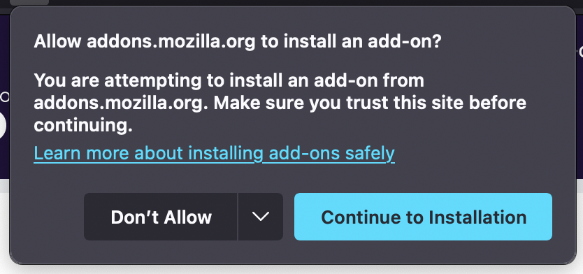
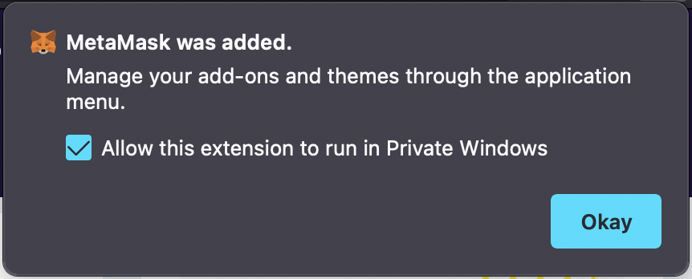

# How to use TOR with Tornado Cash

On-chain confidentiality is ensured by the [Tornado Cash](https://tornado.cash) tool.

However, before and after your transactions are executed, your privacy may not be ensured. That's why we advise you to use TOR when you use Tornado Cash.

Here is a quick and easy tutorial to ensure your anonymity.

### Step **#1 - Install** TOR

First, go there: [https://www.torproject.org/download/](https://www.torproject.org/download/)

Choose the appropriate operator system and click on Download.

Then, run it.

### Step **#2 - Configure** TOR

First, search for `about:config` on your URL navigation bar.

Then, accept the caution message by clicking on `Accept the Risk and Continue`.

Search for `wasm` and turn `javascript.options.wasm` on true.

Search for `indexedDB` and turn `dom.indexedDB.logging.details` and `dom.indexedDB.logging.enabled` on true

### Step **#3 -** Install Metamask

Go there: [https://metamask.io/download/](https://metamask.io/download/)

First, click on `Install Metamask for Firefox`.

Click on `Add`.

Allow addons.mozilla.org to install an add-on by clicking on `Continue to Installation`.

Confirm that you allow this extention to run in Private Windows, then click on `Okay`.

Then, you can add Metamask to your toolbar, by doing a right click on it and dragging Metamask icon to your toolbar.

.gif)

### Step **#4 - Enjoy your privacy** :sunglasses:****

You can now use [Tornado Cash Classic](https://tornadocash.eth.link) or [Tornado Cash Nova](https://nova.tornadocash.eth.link) with TOR.

_Written by_ [_**@bt11ba**_](https://torn.community/u/bt11ba/)
