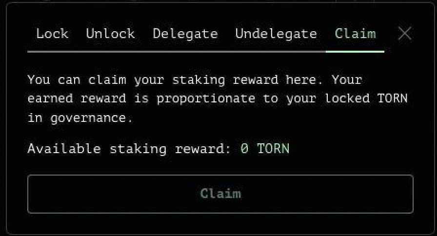

# Staking

Depuis sa création, le token TORN est utilisé par les utilisateurs de Tornado Cash pour la gouvernance. Son utilité principale est de permettre la suggestion de proposition ainsi que le vote sur la blockchain (propositions de gouvernance impliquant des changement du protocole) et hors blockchain (sur Snapshot, n'ayant pas d'impact sur le protocole en lui-même).

Grâce à l'exécution de la [10ème proposition de gouvernance](https://tornadocash.eth.link/governance/10), le token [TORN](torn.md) acquiert une toute nouvelle utilité. En effet, **avec l'introduction d'un registre de **_**relayer**_** décentralisé, la récompense de staking a été implémentée pour tous les utilisateurs verrouillant leurs tokens TORN dans le contrat de gouverance**.

Ces derniers recevront une portion des frais collectés par les relayers. La récompense de staking sera évidemment dépendante de la proportion de tokens [TORN](torn.md) verrouillés par l'utilisateur par rapport à la proportion totale de tokens [TORN](torn.md) verrouillés.

#### D'OÙ VIENNENT CES FRAIS ?

La collection de ces frais est possible grâce à l'implémentation d'un registre décentralisé de _relayer_. Afin d'être listé sur le protocole, les relayers devront verrouiller 300 TORN (ce montant peut être changé à tout moment). Vous trouverez davantage d'informations sur le fonctionnement du registre décentralisé de relayer sur [ce topic de forum](https://torn.community/t/proposal-relayer-registry-setting-parameters-after-audit/2134) et sur cette [page de documentation](registre-de-relayer.md).

Pour chaque retrait utilisant l'option relayer, le relayer choisi devra payer un frais au protocole depuis sa balance de tokens verrouillés (qui devra toujours être maintenue au dessus de `300 TORN` s'il souhaite être listé sur l'UI). Depuis la [10ème proposition de gouvernance](https://tornadocash.eth.link/governance/10), le frais est fixé à `0.3%` et peut être changé à tout moment par un vote de gouvernance.

### Comment staker des tokens TORN ?

Le processus de verrouillage des tokens TORN sur le contrat de gouvernance n'a pas changé, il reste le même.

* Rendez-vous ici: ➡️ [https://tornadocash.eth.link/governance](https://tornadocash.eth.link/governance) ⬅️, cliquez sur **`Manage`**, puis allez sur sur l'onglet **`Lock`**.
* Le contrat de gouvernance a besoin d'être approuvé afin d'autoriser le transfert de tokens sur le smart contract. Pour cela, cliquez sur le bouton **`Approve`**.
* Lorsque l'autorisation est approuvée, vous pourrez choisir le montant de token à verrouiller, puis cliquer sur **`Lock`**
* Pour finir, il suffira de confirmer la transaction dans votre wallet et d'attendre la notification de confirmation.

### Comment réclamer votre récompense de staking ?

Maintenant que vos tokens TORN sont bien au chaud dans le contrat de gouvernance, vous êtes capable de réclamer votre récompense de staking.

Pour cela, tout se passe encore ici ➡️ [https://tornadocash.eth.link/governance](https://tornadocash.eth.link/governance) ⬅️

Dès que vous serez identifié sur la page, vous pourrez aperçevoir en haut de cette dernière votre récompense de staking, qui n'attend plus que vous pour être collectée 💰

* Cliquez sur **`Manage`** -> alez sur longlet **`Claim`** -> cliquez sur le bouton **`Claim`**_._

_C'est fini. Facile non ?_ :wink:__

__

_Ecrit par_ [_@bt11ba_](https://torn.community/u/bt11ba/) _&_ [_@ayefda_](https://torn.community/u/ayefda)_._

Traduit par @erikA
