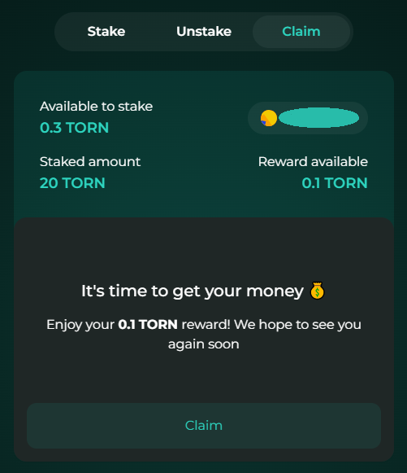
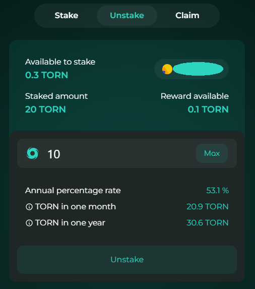

# Altornado

## Alternative staking UI

Since the deployment of [Altornado](https://altornado.com/#/stake) **TORN** holders have now an alternative open-source staking UI made by Tornado Cash Community, for the Tornado Cash community.

Yes, hence the name altornado: from “alternative” and “tornado” 🌝

From the approval of [this](https://snapshot.org/#/torn-community.eth/proposal/0x331caa7b479669e8b836bd87ba9d91427c212ec29a2ede13d84c7190af18c931) snapshot proposal, they will be funded to deliver an amazing roadmap full of new features in the subsequent versions.

Altornado’s source code is and will always be free to access. Altornado do not and will never have access to users data.

The site will always remain accessible to everyone, without any restrictions.

### Ok, this sounds awesome, how do I stake ?

* Let's start here ➡️ [https://altornado.com/#/stake](https://altornado.com/#/stake) ⬅️, connect your wallet clicking on **`Connect your wallet`**.
* You will need to approve the staking contract, so click on the **`Approve`** button.
* After approving, you're ready to stake! You can choose the amount of TORN to stake, then click on **`Stake`** or choose the max amount available in your wallet by clicking **`Max`**.
* Confirm the transaction in your wallet and start enjoying your staking rewards.

### Hmmm, maybe not yet, now you need to claim your rewards in order to do so 😼

* In order to claim your rewards, head over the [Claim](https://altornado.com/#/claim) tab.
* Click on the **`Claim`** button.
* Confirm the transaction in your wallet and wait until your fresh $TORN hits your wallet balance.

### So far so good, but what if I need to unstake ?

* To unstake your [TORN](https://etherscan.io/token/0x77777feddddffc19ff86db637967013e6c6a116c) tokens go to the [Unstake](https://altornado.com/#/unstake) tab.
* Choose the amount of TORN you want to unstake.
* You will now see the **`Unstake`** button, click it.
* Finally, confirm the transaction in your wallet in order to complete the transaction.

_That's it, we're done, easy peasy lemon squeezy_ :wink:

\_\_

_Written by_ [_**@bt11ba**_](https://torn.community/u/bt11ba/) _&_ [_**@ayefda**_](https://torn.community/u/ayefda)
