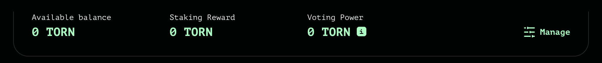

# Tornado Cash

### How to Stake TORN token ?

First, [connect your wallet to Tornado Cash](../../tornado-cash-classic/how-to-connect-your-wallet.md).

As mentioned above, the process to lock TORN tokens has remained unchanged.

* It happens here ➡️ [https://tornadocash.eth.limo/governance](https://tornadocash.eth.limo/governance) ⬅️, by clicking on **`Manage`**, then going on the **`Lock`** tab
* The governance contract need to be approved in order to allow the transfer of your tokens to the smart contract. To do so, you need to click on the **`Approve`** button
* Once the approval is confirmed, you can chose the amount of token to lock, then click on **`Lock`**
* All you have to do after that is to confirm the transaction in your wallet & wait for the confirmation to come through

### How to Claim Your Staking Reward ?

Now that your TORN tokens have stayed nice & warm locked in the governance contract, you are able to claim your staking reward. How to do that? Everything is still happening here ➡️ [https://tornadocash.eth.link/governance](https://tornadocash.eth.limo/governance) ⬅️

As soon as you log in the page, you will be able to see your staking reward at the top, just waiting for you to collect it 💰

* Click **`Manage`** -> **`Claim`** tab -> **`Claim`** _button._

.png>)

##
