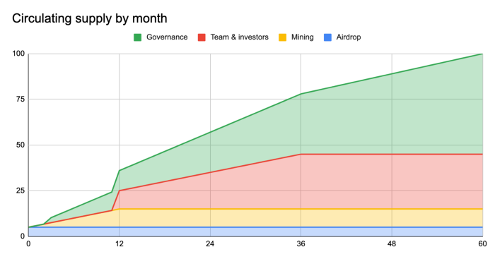
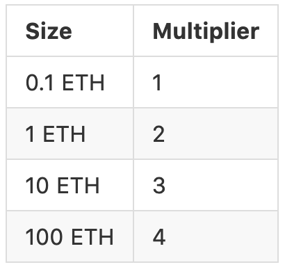
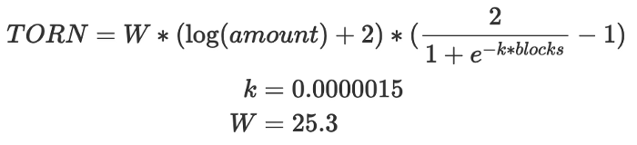

# TORN

## Token

TORN est un jeton compatible ERC20 avec une offre fixe qui régit [Tornado.Cash](https://tornado). **** Les détenteurs de TORN peuvent faire des propositions et voter pour modifier le protocole via la gouvernance.

**TORN n'est pas un dispositif ayant pour but de collecter des fonds ou une opportunité d'investissement.**

**Voici comment se déroulerait la distribution initiale de TORN:**

* **5% (500,000 TORN):** Airdrop aux premiers utilisateurs des pools ETH de [Tornado.Cash](https://tornado.cash) ETH,
* **10% (1,000,000 TORN):** Minage d'anonymat pour les pools ETH de [Tornado.Cash](https://tornado.cash) distribué pendant une durée d'un an,
* **55% (5,500,000 TORN):** Fonds du DAO, qui seront débloqués de manière linéaire sur 5 ans, chaque période de 3 mois,
* **30% (3,000,000 TORN):** Fonds des développeurs initiaux et des premiers supporters et contributeurs, qui seront débloqués sur 3 ans, chaque période de 12 mois.

## Airdrop 

Les utilisateurs qui ont eu foi en [Tornado.Cash](https://tornado.cash) dès le début doivent avoir leur mot à dire dans la gestion du protocole. Pour cette raison, ces derniers ont reçu un airdrop de TORN.

Ces tokens TORN ont été envoyés à [toutes les adresses](https://github.com/tornadocash/airdrop/blob/master/airdrop.csv) qui ont effectué des dépôts dans les pools ETH de [Tornado.Cash](https://tornado.cash) avant le bloc 11400000. Les tokens TORN ont été airdrop sous la forme d'un bon TORN non transférable (vTORN) qui peut être échangé 1:1 contre des TORN dans un délai d'un an, du 18 décembre 2020 au 18 décembre 2021. Les TORN qui ne seront pas échangés seront intégrés au contrat de gouvernance après un an et feront partie de la trésorerie du DAO.

Le montant des TORN dépend de la taille et de l'âge du dépôt des utilisateurs - les dépôts plus importants et les dépôts plus anciens recevront plus de TORN. Les multiplicateurs pour la taille du dépôt sont logarithmiques :

De ce fait, un dépôt de 100 ETH aura deux fois plus de tokens qu'un dépôt 1 ETH. Ce multiplicateur permet à tous les types d'utilisateurs de [Tornado.Cash ](https://tornado.cash)d'avoir leur mot à dire sur la gouvernance.

La courbe exacte pour le multiplicateur ressemble à cela:

Voici la formule exacte du calcul de l'airdrop:

_Ecrit par la_ [_**Team Tornado**_](https://tornado-cash.medium.com/tornado-cash-governance-proposal-a55c5c7d0703)_**.**_

Traduit par @erikA
