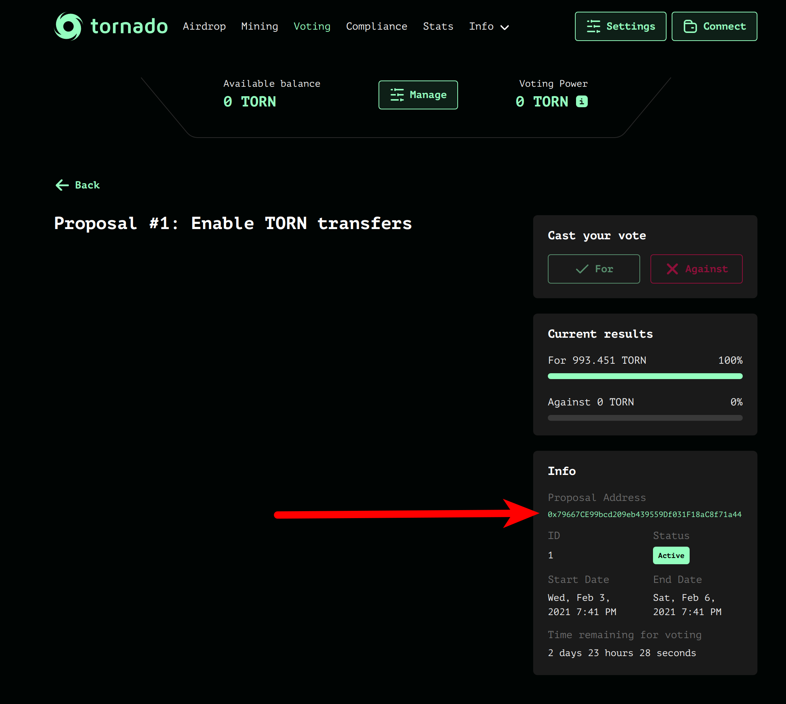
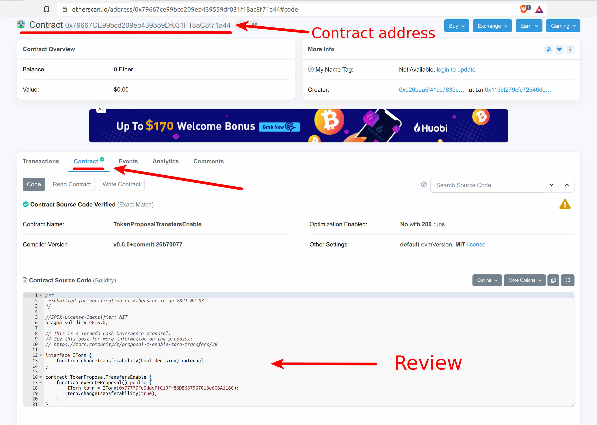
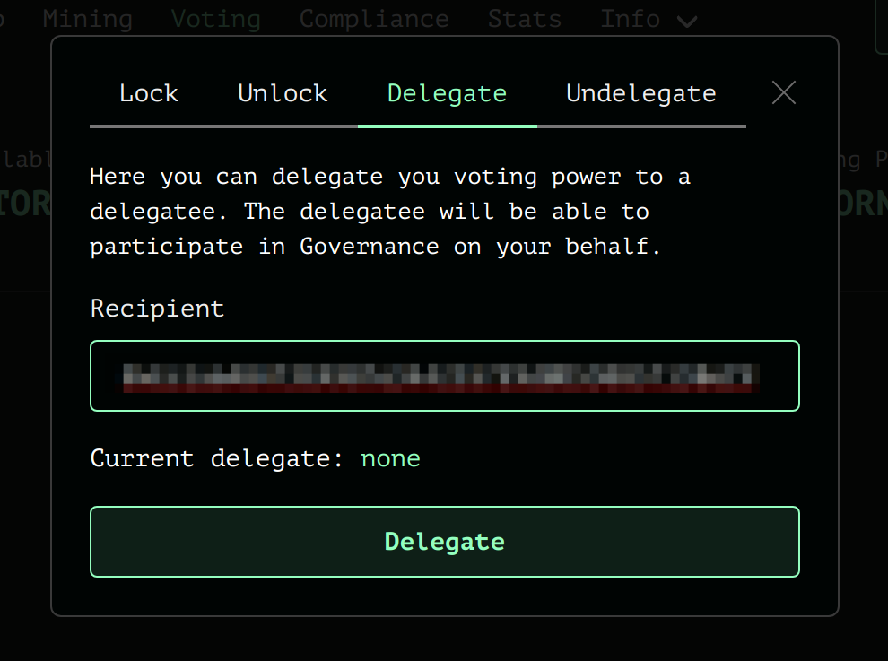

# Gobernanza

### Cómo presentar una propuesta ?

Para participar en el gobierno de Tornado.Cash, los usuarios primero tienen que bloquear tokens en el contrato de gobernanza. Si un usuario vota o crea una propuesta, los tokens no pueden desbloquearse antes del final del periodo de ejecución \(8.25 días desde la creación de la propuesta\). Los tokens bloqueados se pueden también delegar en otra dirección.

Para crear una propuesta, un usuario necesita tener al menos `1000 TORN`. Todas las propuestas deben ser smart contracts con codigo verificado que se ejecutan desde el [contrato de gobierno](https://etherscan.io/address/0x5efda50f22d34F262c29268506C5Fa42cB56A1Ce) \(utilizando `delegatecall`\). De esta manera, es fácil auditar y testear cualquier cambio de gobierno.

El periodo de votacion para una propuesta es de 3 días. Una propuesta tendrá éxito si consigue una mayoría simple de votos y hay al menos `25,000 TORN` de votos totales \(si el resultado es insuficiente, la propuesta automaticamente se descarta\). 

Cuando una propuesta tiene éxito, se congela durante un periodo de 2 días. Despues de éste periodo, cualquier usuario puede ejecutar la propuesta. \(lo que inicia los cambios\). Si la propuesta no se ejecuta en los 3 días posteriores al periodo de latencia, se considera _expirada_ y no puede ser ejecutada.

Todos estos parametros iniciales son relativamente pequeños, ya que no habrá demasiados tokens TORN en circulación al inicia. Conforme la cantidad circulante aumente, la gobernanza podría ajustar estos criterios.

Una propuesta puede ser de la naturaleza siguiente:

* Añadir una nueva pool al proxy de Tornado Cash
* Cambiar los parámetros de recompensas AP
* Reanudar/Pausar los tokens TORN
* Cambiar algunos contratos raíz como el contrato `TornadoTrees` 
* Una combinación de todas las anteriores

Muchas mas se pueden realizar. Para descubrir exactamente qué puede ser modificado a través de la gobernanza en el protocolo, busque las funciones con el modificador `onlyGovernance` en los smart contracts. 

Las funciones de gobierno se representan con una flecha roja en [este diagrama de arquitectura.](https://viewer.diagrams.net/?highlight=0000ff&edit=_blank&layers=1&nav=1&title=tornado-cash-contract-overview.drawio#Uhttps%3A%2F%2Fraw.githubusercontent.com%2FRezan-vm%2Ftornado-cash-edu%2Fmain%2Ftornado-cash-contract-overview.drawio)

NOTA: Partes de este artículo se han recogido de [este artículo de Medium.](https://tornado-cash.medium.com/tornado-cash-governance-proposal-a55c5c7d0703) El crédito es del equipo de Tornado Cash.

### Cómo votar ?

Usted necesitará depositar \(o bloquear\) tokens TORN en el contrato de gobernanza.

Vaya a:[https://app.tornado.cash/governance](https://app.tornado.cash/governance)

Haga clic en `Manage` -&gt; `Lock Tab`

Apruebe el contrato de gobernanza para transferir sus tokens TORN haciendo clic en el botón `Approve`. Una vez la aprobación se haya confirmado, escoja la cantidad que usted quiere depositar y haga clic en `Lock`. Confirme la transacción en su monedero y espere a la confirmación.

Antes de votar, el paso siguiente fundamental es revisar la propuesta.
 Las propuestas legítimas deben tener una entrada dedicada en [Torn.community](https://torn.community/) bajo la categoría _"Proposal"_. El foro proporcionará contexto adicional y argumentos sobre la propuesta. Lea el hilo y fórmese su propia opinión sobre el asunto.

Cuando una propuesta haya sido presentada aparecerá en:
[https://app.tornado.cash/governance](https://app.tornado.cash/governance)
 Las propuestas se implementan en la forma de smart contracts realizando cambios en el sistema. En consecuencia, es importante verificar la dirección del smart contract y revisar su código. Encuentre la dirección del contrato de la propuesta aqui:

Busque la dirección del contrato en Etherscan y asegúrese que el código fuente esta verificado y se puede leer.

Lea el código fuente y asegúrese que concuerda con lo que se describe en la entrada del foro.

Si usted no tiene conocimiento técnico o no se siente cómodo leyendo código en Solidity, consulte con alguien de confianza para que revise el contrato por usted.

Si usted está de acuerdo \(o en desacuerdo\) con el código propuesto, es hora de votar!

Una propuesta tiene una ventana de votación de 3 días. Esto significa que tenemos 3 días para alcanzar el quórum de 25k TORN en votos.

Importante: Una vez haya votado, sus tokens se bloquearán durante 8.25 días desde el momento en que la propuesta fuera presentada \(el inicio de los 3 días para la votación\)- Pasados los 8.25 días, usted puede retirar sus tokens del contrato de gobernanza. Note que usted puede votar en 2 propuestas al mismo tiempo sin incurrir en un periodo adicional de bloqueo \(Solamente la propuesta mas reciente contará para los 8.25 días de bloqueo\).

Para votar, simplemente haga clic en la marca Verde o en la cruz Roja, dependiendo si acepta o rechaza la propuesta. Confirme la transacción con Metamask y su voto se habra realizado!

### Cómo delega el voto ?

Si usted es propietario de tokens TORN, puede delegar su poder de voto a alguien sin tener que enviarle los tokens.

IMPORTANTE: Si usted delega sus tokens y su delegado vota o inicia una propuesta, sus tokens permanecerán bloqueados durante 8.25 días desde el momento que la propuesta en la que se delegaron los votos empiece. Note que usted puede siempre deshacer esta acción y recuperar su poder (_undelegate_) en cualquier momento.

Para activar la delegación, vaya a: [https://app.tornado.cash/governance](https://app.tornado.cash/governance)

Primero necesitará bloquear sus tokens en el contrato de gobernanza. Haga clic en **`Manage`** -&gt; **`Lock`**.

Apruebe el contrato de gobernanza para transferir sus tokens TORN haciendo clic en el botón **`Approve`**. Una vez la aprobación se haya confirmado, escoja la cantidad que quiere delegar y haga clic en **`Lock`**. Confirme la transacción en su monedero y espere la confirmación.

El último paso, es efectuar la delegación. Vaya de nuevo a [https://app.tornado.cash/governance](https://app.tornado.cash/governance)

Haga clic en **`Manage`** -&gt; **`Delegate`**

Rellene con la dirección a la que usted quiere delegar y haga clic en **`Delegate`**. Apruebe la transacción en su monedero y espere la confirmación.

La totalidad de su balance bloqueado se delegará.

Usted puede deshacer la delegación en cualquier momento. Para ello simplemente use el boton `Undelegate` en la pestaña -&gt; `Undelegate`.

_Escrito por_ [**_@rezan_**](https://torn.community/u/Rezan/summary)

_Traducido por_ [_@EeXavi_](https://twitter.com/EeXavi?s=09) 
