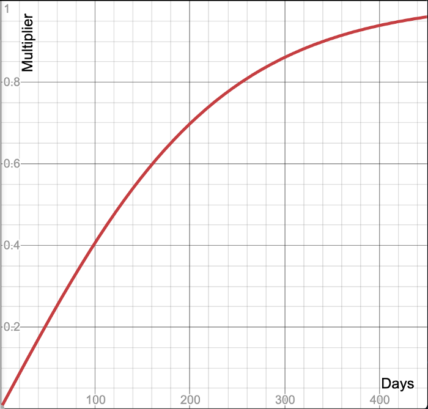

# TORN

## Token

TORN is an ERC20-compatible token with a fixed supply that governs [Tornado.Cash](https://tornado.cash/). TORN holders can make proposals and vote to change the protocol via governance.

**TORN is not a fundraising device or investment opportunity.**

**Here’s how the initial distribution of TORN would break down:**

* **5% \(500,000 TORN\):** Airdrop to early users of [Tornado.Cash](https://tornado.cash/) ETH pools
* **10% \(1,000,000 TORN\):** Anonymity mining for [Tornado.Cash](https://tornado.cash/) ETH pools, distributed linearly over 1 year
* **55% \(5,500,000 TORN\):** DAO treasury, will be unlocked linearly over 5 years with 3 month cliff
* **30% \(3,000,000 TORN\):** Founding developers and early supporters, will be unlocked linearly over 3 years with 1 year cliff

## Airdrop 

Users who have believed in [Tornado.Cash](https://tornado.cash/) from early on should have a say in governing the protocol. For this reason, early adopters of the protocol did receive an airdrop of TORN.

TORN has been airdropped to [all addresses](https://github.com/tornadocash/airdrop/blob/master/airdrop.csv) that made deposits into [Tornado.Cash](https://tornado.cash/) ETH pools before block `11400000`. TORN were airdropped in the form of a non-transferable TORN voucher \(vTORN\) that can be redeemed 1:1 to TORN within 1 year, from December 18, 2020, to December 18, 2021. TORN that aren’t redeemed will be swept into the governance contract after 1 year and become part of the DAO Treasury. Redeemed TORN will be available immediately.

The airdropped amount depends on users’ deposit size and age — larger deposits and older deposits will receive more TORN. Multipliers for deposit size are logarithmic:

So a 100 ETH deposit get twice as many tokens as a 1 ETH deposit. The multiplier allows large and small users of [Tornado.Cash](https://tornado.cash/) to both have a say in governance.

The exact curve for the time multiplier looks like this:

The exact airdrop formula is the following:

_Written by_ [_**Tornado Team**_](https://tornado-cash.medium.com/tornado-cash-governance-proposal-a55c5c7d0703)

