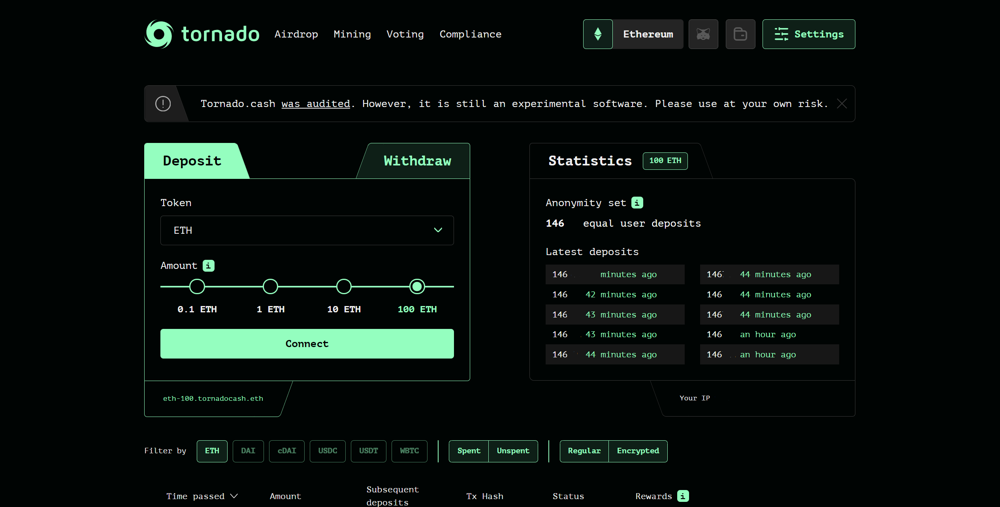
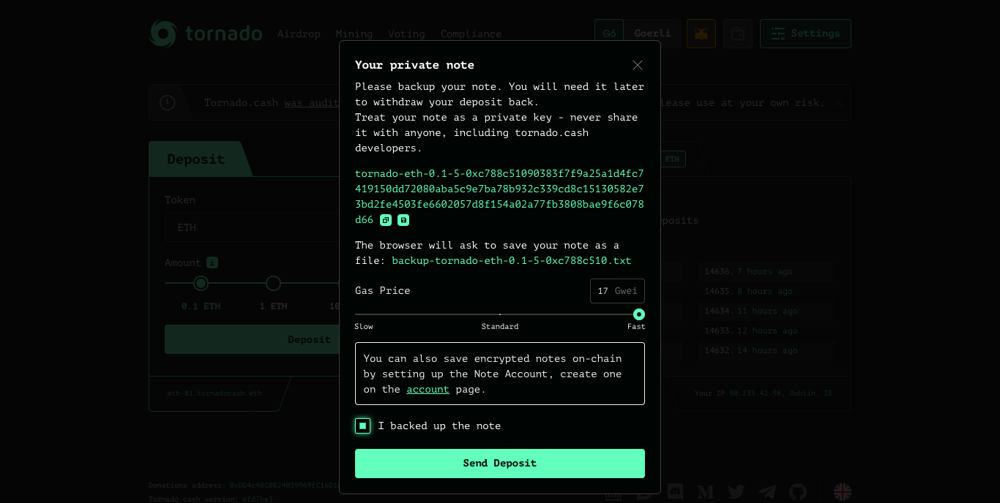
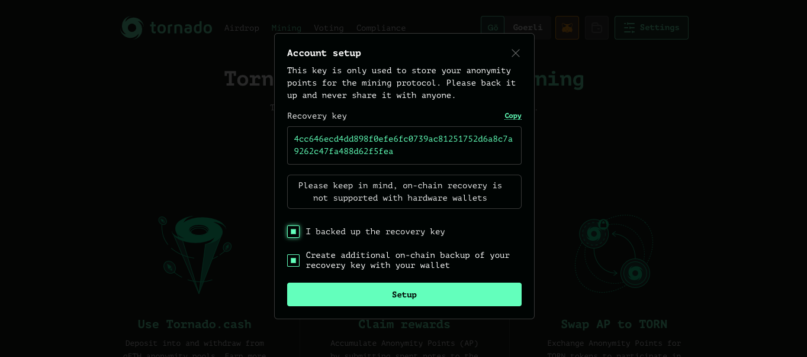
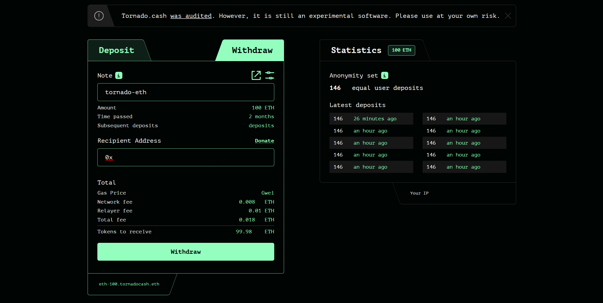
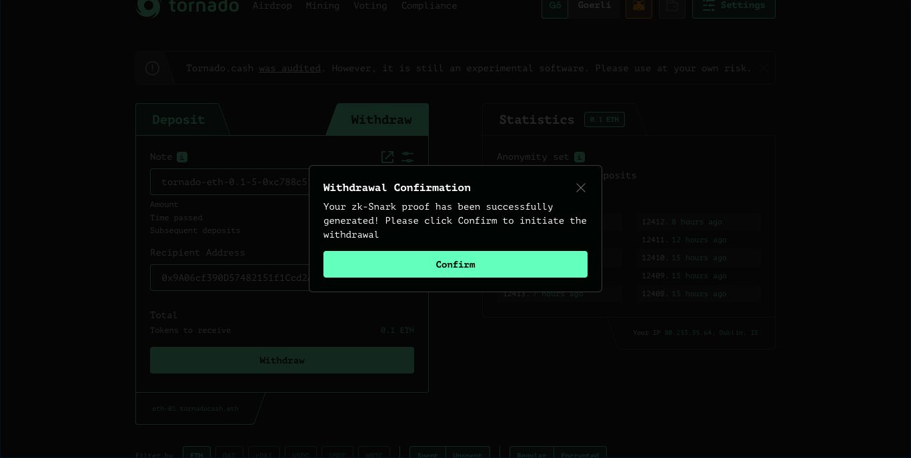
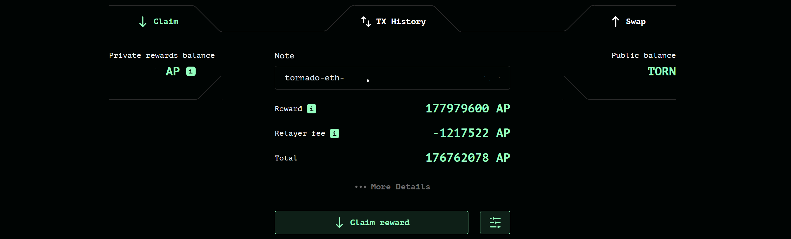
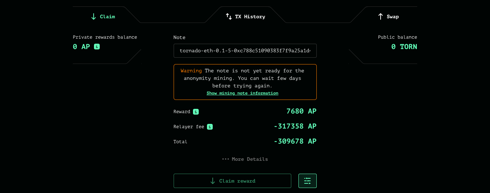

# Minage d'anonymat

Le minage d'anonymat est une incitation visant à accroître le niveau de confidentialité en récompensant les participants par des points d'anonymat (AP) en fonction de la durée pendant laquelle ils laissent leurs actifs dans une pool.


_Cette incitation a débuté le 18 décembre 2020 et s'est terminée le 18 décembre 2021._


Les personnes déposent dans l'une des pools d'anonymat pris en charge (ETH, WBTC, DAI ou cDAI) et sont récompensées par un montant fixe d'AP par bloc, pendant la période où leur dépôt reste dans la pool. Ces points peuvent ensuite être échangés contre des TORN une fois les fonds retirés.

### Points d'anonymats (_Anonymity Points_ - AP)

_Les utilisateurs doivent savoir que certains dépôts à faible incitation, au moment de la rédaction de ce document, ne produisent pas un rendement positif en raison des frais de gaz nécessaires pour retirer, racheter et échanger des points d'anonymat._

L'un des membres de la communauté a créé une [feuille de calcul de minage d'anonymat ](https://torn.community/t/anonymity-mining-spreadsheet/720)qui permet de calculer le rendement annuel en pourcentage (APY) pour chaque pool et chaque token, en estimant les frais nécessaires pour réclamer une récompense. **Il est fortement recommandé de consulter cette ressource et de planifier son plan d'action avant de s'attendre à obtenir un rendement.** Au bas de la feuille de calcul, vous pouvez visualiser chaque pool en sélectionnant l'onglet associé.

### Comment acquérir des AP

1\. Décidez quel montant et actif vous souhaitez déposer en sélectionnant cela dans le menu déroulant, avant de cliquer sur `Connect` et `Deposit`

2\. Enregistrez votre note et sauvegardez la dans un endroit sûr. **Ne la partagez avec personne, au risque de perdre votre dépôt ainsi que votre récompense.**

3\. Générez la preuve et envoyez la transaction

4\. Votre dépôt devrait maintenant être visible en bas de la page. Vous pouvez suivre combien d'AP ont été gagnés dorénavant. Rappelez-vous : plus vous attendez, plus vous gagnez des points d'anonymats.

_Les notes dites "actives" (non retirées) sont dites des notes "non dépensées" (unspent note)_

### Comment réclamez vos AP

1\. Premièrement vous devez créer un compte de minage et enregistrer ces informations on-chain pour plus de simplicité. Cette feature n'est pas supportée par les portefeuilles froids (hardware wallet) tels que Ledger, Trezor.. Si vous disposez d'un hardware wallet, il faudra conserver manuellement votre note.

2\. Retirez vos fonds

**Rappelez-vous de toujours conserver votre note dans un endroit sûr, même après votre retrait, car elle permet de réclamer les points d'anonymats.**

3\. Visitez l'onglet `Mining` et entrez votre note dépensée.

* **Si votre note peut réclamer des AP**: cliquez sur `Claim reward` et soumettez votre transaction (avec l'usage d'un relais ou non)

&#x20;

* **Si votre note ne peut pas encore réclamer des AP:** _“Warning: The note is not yet ready for anonymity mining. You can wait few days before trying again”_ - Cela veut dire que votre note n'est pas encore prête pour le minage d'anonymat, car les Merkle trees n'ont pas encore été mis-à-jour. Patientez quelques jours :)

Mettre à jour les Merkle trees peut être un processus cher. Il est recommandé que les utilisateurs avec de petit dépôts attendent que les plus gros dépositaires mettent à jour les trees. Cela peut mettre plusieurs jours, voire semaines. Si vous souhaitez vérifier cela, cliquez sur le lien _`Show mining note information`_. Ici, vous pourrez mettre à jour les Merkle trees.

### Comment échanger ses AP

1\. Cliquez sur l'onglet `Swap` sur la page de minage.

2\. Entrez le montant d'AP que vous souhaitez échanger (ou sélectionnez Max pour échanger l'intégralité de vos AP) et fournissez une adresse de retrait. Vous pouvez ici aussi faire le choix d'utiliser un relais ou non.

3\. Si toutes ces étapes ont été respectées, les TORN vous seront envoyés sur l'adresse que vous avez indiqué.

### Remarques

Il est recommandé de faire attention au taux [AP/TORN ](https://duneanalytics.com/luckyallocator/Daily-AP-TORN-Rate-v2)qui dépend de l'offre et la demande d'AP.

Pour plus d'informations sur le minage d'anonymat, voici troFor more information on anonymity mining, seek the following resources:

* [Tornado.Cash governance proposal article](https://tornado-cash.medium.com/tornado-cash-governance-proposal-a55c5c7d0703)
* [Tornado.Cash anonymity mining optimisation article](https://tornado-cash.medium.com/gas-price-claimed-anonymity-mining-a-victim-but-now-everyone-can-claim-ap-5441aaa32a1a)&#x20;
* [Anonymity mining explained (technical)](https://torn.community/t/anonymity-mining-technical-overview/15)

_Ecrit par_ [_**@xgozzy**_](https://torn.community/u/xgozzy/summary)__

Traduit par @erikA
