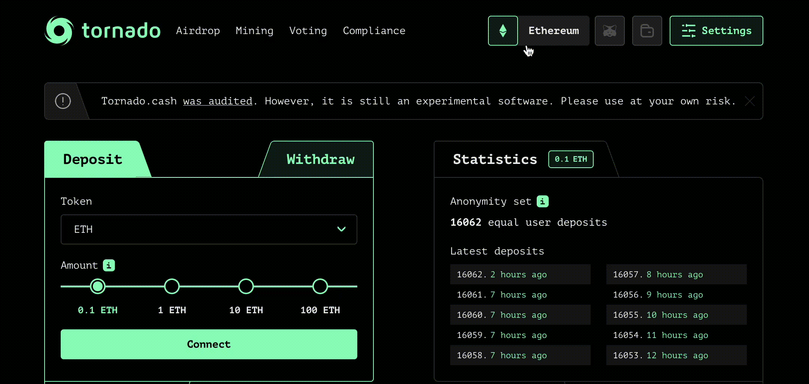
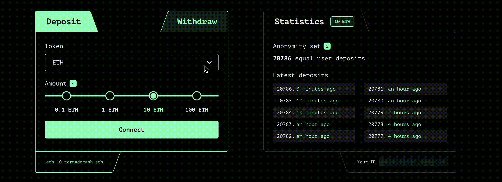
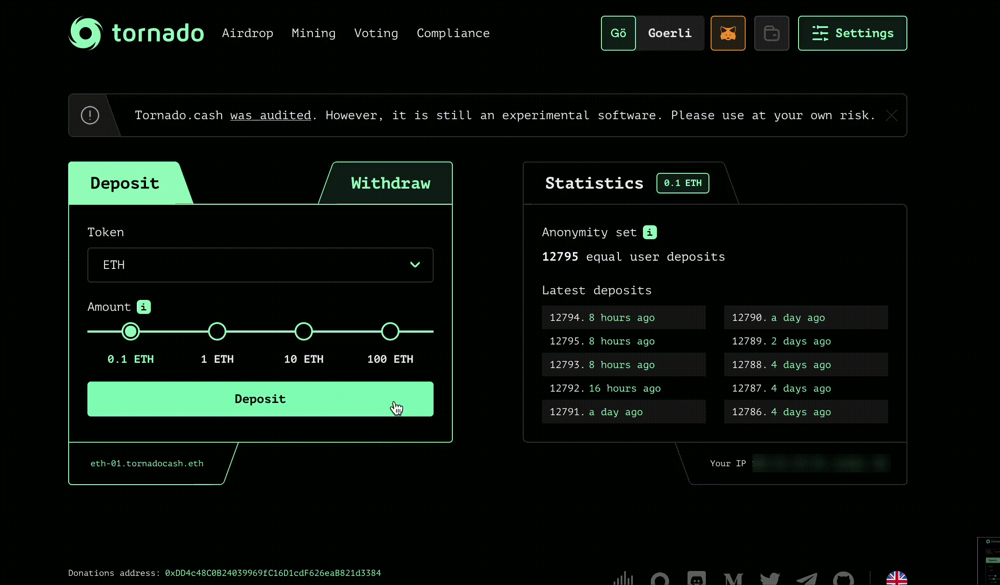
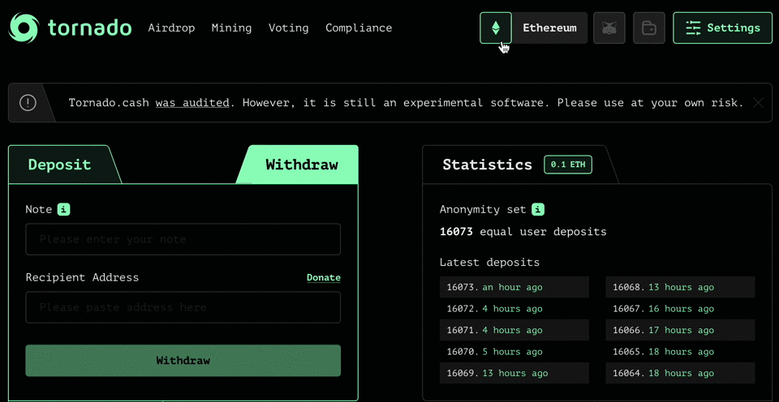
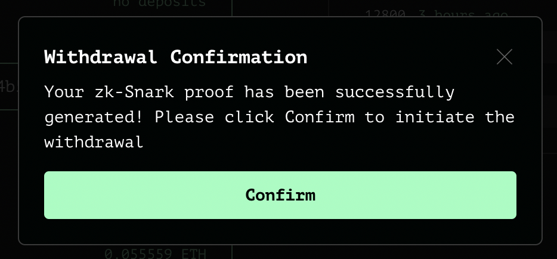

# Depósito y Retiro

Este tutorial es una guía paso a paso de cómo depositar y retirar sus fondos. Si quiere entender como funciona internamente Tornado.Cash, por favor diríjase a [este tutorial](https://docs.tornado.cash/how-does-tornado.cash-work).

## **Depósito**

### Escoja una cadena

Tornado.Cash esta disponible en diferentes blockchains, deberá escoger entre 4 cadenas:

### Seleccione un token

Escoja el token que quiere depositar y la cantidad:

### Conecte su monedero

Clique en `Connect` y escoja entre los diversos proveedores de monederos, tales como Metamask o WalletConnect.

### Guarde su nota

Clique en `Deposit` y guarde su nota en un lugar seguro antes de hacer clic en `I backed up the note` \(_He guardado la nota_\). Puede incluso guardar notas encriptadas _on-chain_ configurando una _Note Account_, haciendo clic en `Settings` \(esquina superior derecha\).

### Sea paciente

Como se ha explicado [aqui](https://docs.tornado.cash/tips-to-remain-anonymous#be-patient), a mayor espera, mayor grado de anonimato se obtiene.

Felicidades ! Lo ha conseguido. Ahora sus tokens estan en la pool de Tornado.Cash.

## Retiro

### Escoja una cadena

Tornado.Cash esta disponible en diferentes blockchains, deberá escoger entre 4 cadenas:

### Pegue su nota

Pegue su nota de depósito en el cuadro correspondiente. Haga clic en `Withdraw` y espere a que la zk-SNARK proof se genere.

### Confirme tu retiro

Hecho !

_Escrito por_ [_**@bt11ba**_](https://torn.community/u/bt11ba/)\
_Traducido por_ [_@EeXavi_](https://twitter.com/EeXavi?s=09) 

